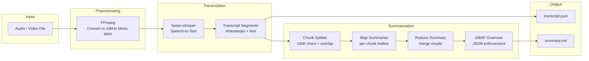
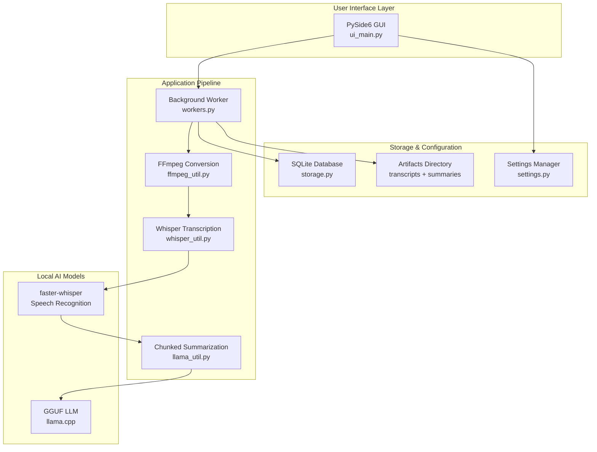
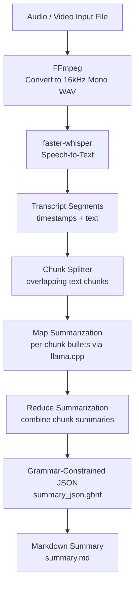
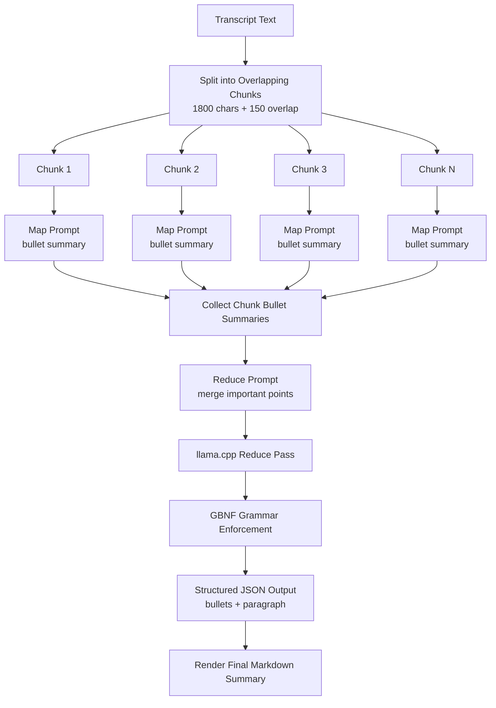
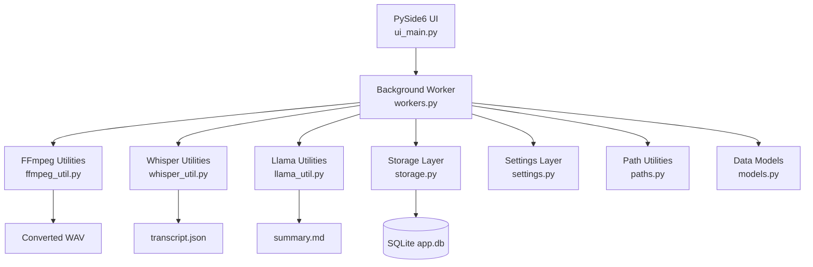

# AI-Assisted Audio Transcription and Summarization System

This repository contains the senior capstone project for the Informatics program.

---

## Project Overview
The project focuses on designing and evaluating a human-centered system that converts audio recordings into text transcripts and concise summaries using existing AI services.

AI-Assisted Audio Transcription and Summarization System is a fully offline audio transcription and summarization application built with:

- **Whisper (faster-whisper)** for speech-to-text
- **llama.cpp** for local LLM summarization
- **PySide6** for the graphical interface
- **SQLite** for job tracking
- **FFmpeg** for media conversion

The application converts audio/video into transcripts and generates structured summaries entirely on the user's machine.

No cloud services required.

### Architecture Diagram



### Layered System Architecture



The AI-Assisted Audio Transcription and Summarization System follows a layered architecture:

**User Interface Layer**
- PySide6 GUI for file selection, progress monitoring, and results display.

**Application Pipeline**
- Background worker executes the full transcription and summarization pipeline.

**Model Layer**
- faster-whisper performs speech recognition.
- llama.cpp generates structured summaries using local GGUF models.

**Storage Layer**
- SQLite tracks processing jobs.
- Settings are persisted in JSON.
- Generated transcripts and summaries are stored as artifacts.

---

## Features

• Fully **offline transcription** using faster-whisper  
• **Local LLM summarization** using GGUF models via llama.cpp  
• **Chunked map → reduce summarization pipeline**  
• **Grammar-constrained JSON output** for stable summaries  
• **Audio/video input support** via FFmpeg  
• **GUI interface built with PySide6**  
• **Export transcripts and summaries**  
• **Job tracking database** using SQLite  

---

## Team Members
- Anuj Rimal
- Zack Ganser
- Saahil Patel
- Hoyda Al Yahiri

---

## Status
Framework and prototype built. Building out additional features.

---

## Architecture Overview
The AI-Assisted Audio Transcription and Summarization System is designed as a fully local transcription and summarization pipeline.
All processing runs on the user's machine using open-source models and tools.

The system combines:
* FFmpeg for media preprocessing
* Whisper (faster-whisper) for speech-to-text transcription
* llama.cpp for local LLM summarization
* PySide6 for the graphical interface
* SQLite for job tracking and metadata

### End-to-End Pipeline Diagram
The complete workflow transforms a media file into a structured transcript and summary.

### Processing Stages

1. **Media Conversion**
   * FFmpeg converts any input media into 16kHz mono WAV, the format Whisper performs best with.
2. **Speech Recognition**
   * faster-whisper generates timestamped transcript segments.
3. **Chunked Summarization**
   * The transcript is split into overlapping chunks to fit within LLM context limits.
4. **Map → Reduce Summarization**
   * Each chunk is summarized independently.
   * The summaries are merged into a final structured summary.
5. **Structured Output**
   * A GBNF grammar ensures the model outputs valid JSON.
6. **Final Summary**
   * The structured summary is converted into Markdown for display and export.

### Map → Reduce Architecture (LLM Pipeline)
Large transcripts exceed the context window of most local models.

To solve this, the application uses a **two-stage summarization architecture**.


### Why Map → Reduce?

This design improves reliability and scalability:
* Allows **summarizing long transcripts**
* Keeps each model prompt **within context limits**
* Produces **higher quality summaries**
* Works well with **local models**

### Application Architecture
The application separates the **UI layer**, **processing pipeline**, and **support modules**.



### Key Modules
| Module            | Responsibility                                    |
| ----------------- | ------------------------------------------------- |
| `ui_main.py`      | Main GUI built with PySide6                       |
| `workers.py`      | Background transcription + summarization pipeline |
| `ffmpeg_util.py`  | Audio/video conversion utilities                  |
| `whisper_util.py` | faster-whisper transcription wrapper              |
| `llama_util.py`   | Chunked summarization system                      |
| `settings.py`     | Application configuration management              |
| `storage.py`      | SQLite job tracking                               |
| `paths.py`        | Platform-aware path management                    |
| `models.py`       | Shared data structures                            |

### Structured Output
The final summary is returned as JSON:
```json
{
  "bullets": [
    "Key point 1",
    "Key point 2"
  ],
  "paragraph": "A concise paragraph summarizing the discussion."
}
```

This JSON is then converted into a **Markdown summary** for display and export.

### Design Goals
The AI-Assisted Audio Transcription and Summarization System was built with the following principles:
* **Fully Offline** — no cloud APIs required
* **Reliable Output** — grammar-constrained JSON generation
* **Scalable Summarization** — map → reduce pipeline
* **Modular Architecture** — clean separation of UI, processing, and utilities
* **Portable** — works as a Python app or packaged executable

---

## Summarization Pipeline

The summarization system uses a **two-stage architecture** designed for reliability with local LLMs.

### Map Step

The transcript is split into overlapping chunks.

Each chunk is summarized independently into bullet points.

```
Transcript
│
├─ Chunk 1 → bullets
├─ Chunk 2 → bullets
├─ Chunk 3 → bullets
```

### Reduce Step

All chunk summaries are merged into a final summary.

The model is required to output structured JSON:

```json
{
  "bullets": ["..."],
  "paragraph": "..."
}
```
A GBNF grammar constraint ensures valid JSON output.

### Why Grammar Constrained Decoding?
Local LLMs frequently produce malformed JSON.

This project uses GBNF grammars in llama.cpp to guarantee structured output.

This prevents:
* missing braces
* trailing explanations
* markdown wrapping
* partial JSON

---

## Repository Structure

```
LocalTranscriber
│
├─ app/
│   ├─ ui_main.py          # Main PySide6 application window
│   ├─ workers.py          # Background transcription + summarization pipeline
│   ├─ settings.py         # Application configuration management
│   ├─ paths.py            # Application path utilities
│   ├─ storage.py          # SQLite database access
│   ├─ models.py           # Data structures for transcripts
│   │
│   ├─ ffmpeg_util.py      # FFmpeg discovery and audio conversion
│   ├─ whisper_util.py     # faster-whisper transcription wrapper
│   └─ llama_util.py       # llama.cpp summarization pipeline
│
├─ assets/
│   ├─ bin/                # Bundled binaries (ffmpeg, llama.cpp)
│   ├─ grammars/
│   │     summary_json.gbnf
│   └─ models/
│         ├─ whisper/
│         │     small/
│         └─ llm/
│               model.gguf
│
│
├─ README.md
└─ main.py
```

---

## Dependencies
### Python libraries
```
PySide6
faster-whisper
ctranslate2
```
### External Tools
```
FFmpeg
llama.cpp
```

---

## Settings
The application supports configuration for:

* Whisper model selection
* Device (CPU / CUDA)
* Compute precision
* FFmpeg path override
* llama.cpp binary path
* GGUF summarization model
* LLM context size
* LLM thread count

Settings are stored in:
```
settings.json
```

---

## Output Files
Each job produces:
```
transcript.json
summary.md
audio_16k.wav
```
You can find the output files at:

Windows:
```
%APPDATA%\\LocalTranscriber
```
macOS:
```
~/Library/Application Support/LocalTranscriber
```
Linux / Unix:
```
~/.localtranscriber
```

---

## Dev Quickstart
### Note on Python Environment
You will need Python 3.12 to run the program. Newer versions of Python (eg. 3.13/3.14) are not supported by some of the dependencies.
The program will not work correctly if you use a version of Python other than 3.12. 

The setup scripts located in the scripts folder that was cloned from the GitHub repo should install the correct version of Python for you.

### 1) Install uv
We will be using uv to automatically install the correct version of Python and manage the virtual environment.

To install uv on your computer open up a command prompt/terminal and run one of the commands below based on your OS.

### macOS / Linux
```
curl -LsSf https://astral.sh/uv/install.sh | sh
```

### Windows
```
powershell -ExecutionPolicy ByPass -c "irm https://astral.sh/uv/install.ps1 | iex"
```

### 2) Clone
Pull down the GitHub repo to the IDE of your choice

### 3) Run the Setup Script
In your command prompt/terminal navigate to the root of your project folder and run one of the commands below
based on your OS.

### macOS / Linux
```
./scripts/setup.sh
```

### Windows
```
powershell -ExecutionPolicy Bypass -File scripts/setup.ps1
```

The setup script will:
1. Create a Python 3.12 virtual environment
2. Install Python dependencies
3. Download required binaries
4. Download Whisper models
5. Download the LLM model

### 4) Run
Once the environment is set up and the assets are in place you can run the app from your IDE